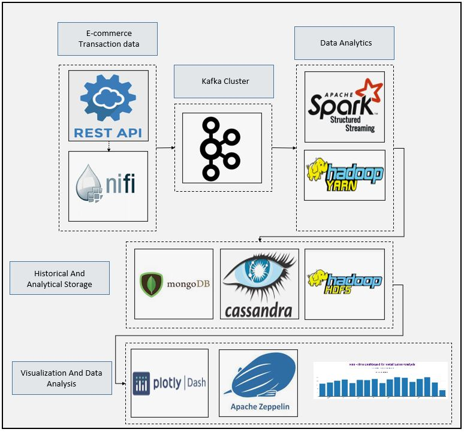
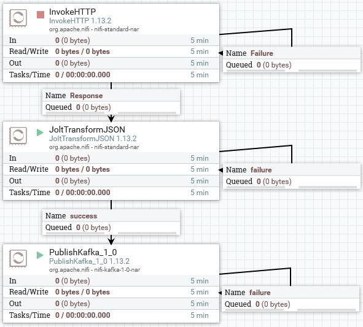
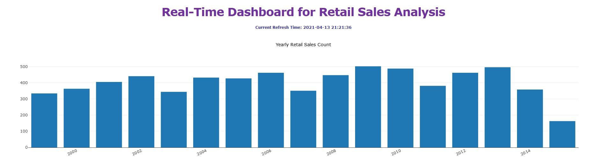
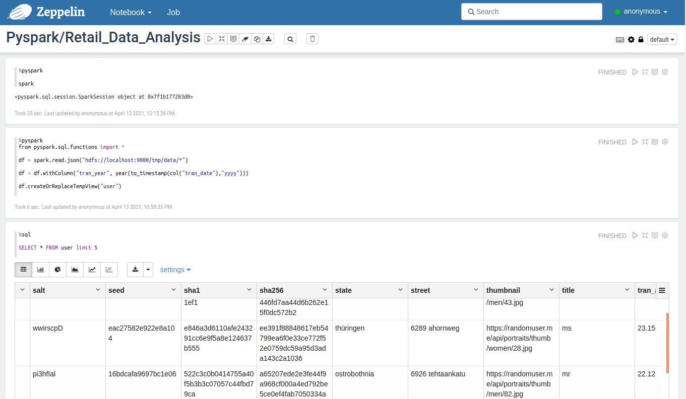

# SparkStream E-commerce Transaction Analysis and Storage
### Dataflow Pipeline


### Summary

In this application artificial transaction informations generated by rest api and consumed by nifi as a source data. Source data published continuously to kafka topic. Kafka topic consumed using Pyspark api and several dataframe structed to store them hdfs, mongo db and cassandra databases. Dash and plotly used to visualize data from mongo db and apache zeppelin used to analyse historical data which we stored into hdfs file system. This is very good application to see how you can connect your spark application with several storage system and how you can structure your data using spark structural streaming api.

### Task List

- [x] Create nifi pipeline using InvokeHTTP, JoltTransformJSON and PublishKafka



- [x] Use https://randomuser.me/api/0.8 to generate random user data
- [x] Create kafka topic
- [x] Create cassandra table
```
CREATE KEYSPACE trans_ks WITH replication = {'class': 'SimpleStrategy', 'replication_factor' : 1};

CREATE TABLE trans_ks.trans_message_detail_tbl (user_id TEXT PRIMARY KEY, first_name TEXT, last_name TEXT, gender TEXT, city TEXT, state TEXT, zip TEXT, email TEXT, nationality TEXT, tran_card_type TEXT, tran_date TEXT, product_id TEXT, tran_amount DOUBLE);
```
- [x] Create mongo db collection
```
db.createUser({user:"demouser",pwd:"demouser",roles:[{role:"readWrite",db:"trans_db"}]})
mongo -u demouser -p --authenticationDatabase trans_db

db.createCollection("year_wise_total_sales_count")

db.createCollection("country_wise_total_sales_count")
```
- [x] Create hdfs folder for historical data
```
hdfs dfs -mkdir -p /tmp/data
```
- [x] Check your hdfs port for spark code
```
hdfs getconf -confKey fs.defaultFS
```
- [x] Create spark code and define kafka, cassandra and mongo db connection details
```
# Kafka Broker/Cluster Details
KAFKA_TOPIC_NAME_CONS = "commerce"
KAFKA_BOOTSTRAP_SERVERS_CONS = 'localhost:9092'

# Cassandra Cluster Details
cassandra_connection_host = "localhost"
cassandra_connection_port = "9042"
cassandra_keyspace_name = "trans_ks"
cassandra_table_name = "trans_message_detail_tbl"

# MongoDB Cluster Details
mongodb_host_name = "localhost"
mongodb_port_no = "27017"
mongodb_user_name = "demouser"
mongodb_password = "demouser"
mongodb_database_name = "trans_db"
```
- [x] Create foreachBatch function to save batch data into cassandra
```
# Cassandra database save foreachBatch udf function
def save_to_cassandra_table(current_df, epoc_id):
    print("Inside save_to_cassandra_table function")
    print("Printing epoc_id: ")
    print(epoc_id)

    current_df \
    .write \
    .format("org.apache.spark.sql.cassandra") \
    .mode("append") \
    .option("spark.cassandra.connection.host", cassandra_connection_host) \
    .option("spark.cassandra.connection.port", cassandra_connection_port) \
    .option("keyspace", cassandra_keyspace_name) \
    .option("table", cassandra_table_name) \
    .save()
    print("Exit out of save_to_cassandra_table function")
```
- [x] Create foreachBatch function to save batch data into mongo db
```
def save_to_mongodb_collection(current_df, epoc_id, mongodb_collection_name):
    print("Inside save_to_mongodb_collection function")
    print("Printing epoc_id: ")
    print(epoc_id)
    print("Printing mongodb_collection_name: " + mongodb_collection_name)

    spark_mongodb_output_uri = "mongodb://" + mongodb_user_name + ":" + mongodb_password + "@" + mongodb_host_name + ":" + mongodb_port_no + "/" + mongodb_database_name + "." + mongodb_collection_name

    current_df.write.format("mongo") \
        .mode("append") \
        .option("uri", spark_mongodb_output_uri) \
        .option("database", mongodb_database_name) \
        .option("collection", mongodb_collection_name) \
        .save()

    print("Exit out of save_to_mongodb_collection function")
```
- [x] Start spark session and set timeParserPolicy as Legacy
```
# Create spark session
    spark = SparkSession \
        .builder \
        .appName("Real-Time Data Pipeline") \
        .master("local[*]") \
        .config('spark.jars.packages', 'org.mongodb.spark:mongo-spark-connector_2.12:2.4.1')\
        .config("spark.streaming.stopGracefullyOnShutdown", "true") \
        .getOrCreate()

# Setting timeParserPolicy as Legacy to get previous version timeparse behaviour
    spark.conf.set("spark.sql.legacy.timeParserPolicy", "LEGACY")
# Setting log level to error
    spark.sparkContext.setLogLevel("ERROR")
```
- [x] Read fata from kafka and define schema
```
# Construct a streaming DataFrame that reads from kafka topic
    transaction_detail_df = spark \
        .readStream \
        .format("kafka") \
        .option("kafka.bootstrap.servers", KAFKA_BOOTSTRAP_SERVERS_CONS) \
        .option("subscribe", KAFKA_TOPIC_NAME_CONS) \
        .option("startingOffsets", "latest") \
        .option("failOnDataLoss", "false") \
        .load()

    print("Printing Schema of transaction_detail_df: ")
    transaction_detail_df.printSchema()


# Schema
    transaction_detail_schema = StructType([
      StructField("results", ArrayType(StructType([
        StructField("user", StructType([
          StructField("gender", StringType()),
          StructField("name", StructType([
            StructField("title", StringType()),
            StructField("first", StringType()),
            StructField("last", StringType())
          ])),
          StructField("location", StructType([
            StructField("street", StringType()),
            StructField("city", StringType()),
            StructField("state", StringType()),
            StructField("zip", IntegerType())
          ])),
          StructField("email", StringType()),
          StructField("username", StringType()),
          StructField("password", StringType()),
          StructField("salt", StringType()),
          StructField("md5", StringType()),
          StructField("sha1", StringType()),
          StructField("sha256", StringType()),
          StructField("registered", IntegerType()),
          StructField("dob", IntegerType()),
          StructField("phone", StringType()),
          StructField("cell", StringType()),
          StructField("PPS", StringType()),
          StructField("picture", StructType([
            StructField("large", StringType()),
            StructField("medium", StringType()),
            StructField("thumbnail", StringType())
          ]))
        ]))
      ]), True)),
      StructField("nationality", StringType()),
      StructField("seed", StringType()),
      StructField("version", StringType()),
      StructField("tran_detail", StructType([
        StructField("tran_card_type", ArrayType(StringType())),
        StructField("product_id", StringType()),
        StructField("tran_amount", DoubleType())
      ]))
    ])

```
- [x] Deserialize kafka data and explode/flatten structure
```
#Deserialize kafka value and flatten prepare dataframe
    transaction_detail_df_1 = transaction_detail_df.selectExpr("CAST(value AS STRING)")

    transaction_detail_df_2 = transaction_detail_df_1.select(from_json(col("value"), transaction_detail_schema).alias("message_detail"))

    transaction_detail_df_3 = transaction_detail_df_2.select("message_detail.*")

    print("Printing Schema of transaction_detail_df_3: ")
    transaction_detail_df_3.printSchema()

    transaction_detail_df_4 = transaction_detail_df_3.select(explode(col("results.user")).alias("user"),
                                                            col("nationality"),
                                                            col("seed"),
                                                            col("version"),
                                                            col("tran_detail.tran_card_type").alias("tran_card_type"),
                                                            col("tran_detail.product_id").alias("product_id"),
                                                            col("tran_detail.tran_amount").alias("tran_amount")
                                                            )

    transaction_detail_df_5 = transaction_detail_df_4.select(
      col("user.gender"),
      col("user.name.title"),
      col("user.name.first"),
      col("user.name.last"),
      col("user.location.street"),
      col("user.location.city"),
      col("user.location.state"),
      col("user.location.zip"),
      col("user.email"),
      col("user.username"),
      col("user.password"),
      col("user.salt"),
      col("user.md5"),
      col("user.sha1"),
      col("user.sha256"),
      col("user.registered"),
      col("user.dob"),
      col("user.phone"),
      col("user.cell"),
      col("user.PPS"),
      col("user.picture.large"),
      col("user.picture.medium"),
      col("user.picture.thumbnail"),
      col("nationality"),
      col("seed"),
      col("version"),
      col("tran_card_type"),
      col("product_id"),
      col("tran_amount")
    )

```
- [x] Create user defined function to generate/simulate card type for each user and convert datetime from unixtime to timestamp
```
# Create user defined function to generate/simulate card type for each user
    def randomCardType(transaction_card_type_list):
        return random.choice(transaction_card_type_list)

    getRandomCardType = udf(lambda transaction_card_type_list: randomCardType(transaction_card_type_list), StringType())

    transaction_detail_df_6 = transaction_detail_df_5.select(
      col("gender"),
      col("title"),
      col("first").alias("first_name"),
      col("last").alias("last_name"),
      col("street"),
      col("city"),
      col("state"),
      col("zip"),
      col("email"),
      concat(col("username"), round(rand() * 1000, 0).cast(IntegerType())).alias("user_id"),
      col("password"),
      col("salt"),
      col("md5"),
      col("sha1"),
      col("sha256"),
      col("registered"),
      col("dob"),
      col("phone"),
      col("cell"),
      col("PPS"),
      col("large"),
      col("medium"),
      col("thumbnail"),
      col("nationality"),
      col("seed"),
      col("version"),
      getRandomCardType(col("tran_card_type")).alias("tran_card_type"),
      concat(col("product_id"), round(rand() * 100, 0).cast(IntegerType())).alias("product_id"),
      round(rand() * col("tran_amount"), 2).alias("tran_amount")
    )
# Card type, transaction amount and product id is hard coded into data inside of apache nifi jolt transform processor
# Card type hard coded as a list ['Visa, MasterCard etc.']
# Here card type is randomly generated/selected using user defined function

# Convert unixtime to timestamp
    transaction_detail_df_7 = transaction_detail_df_6.withColumn("tran_date",
      from_unixtime(col("registered"), "yyyy-MM-dd HH:mm:ss"))

```
- [x] Write data into hdfs
```
# Write raw data into HDFS
    transaction_detail_df_7.writeStream \
      .trigger(processingTime='5 seconds') \
      .format("json") \
      .option("path", "hdfs://localhost:9000/tmp/data") \
      .option("checkpointLocation", "/home/enes/Applications/data") \
      .start()
```
- [x] Create hot data structure and write it into cassandra db
```
# Get hot data for processing
    transaction_detail_df_8 = transaction_detail_df_7.select(
      col("user_id"),
      col("first_name"),
      col("last_name"),
      col("gender"),
      col("city"),
      col("state"),
      col("zip"),
      col("email"),
      col("nationality"),
      col("tran_card_type"),
      col("tran_date"),
      col("product_id"),
      col("tran_amount"))

# Save data to cassandra
    transaction_detail_df_8 \
    .writeStream \
    .trigger(processingTime='5 seconds') \
    .outputMode("update") \
    .foreachBatch(save_to_cassandra_table) \
    .start()
```
- [x] Data processing and write data into mongo db
```
# Data Processing/Data Transformation
    transaction_detail_df_9 = transaction_detail_df_8.withColumn("tran_year", \
      year(to_timestamp(col("tran_date"), "yyyy")))

# Get year wise total sales
    year_wise_total_sales_count_df = transaction_detail_df_9.groupby('tran_year').agg(
        fn.count('tran_amount').alias('tran_year_count'))

# Create collection name for year wise aggregated data mongodb collection
    mongodb_collection_name = "year_wise_total_sales_count"

# Write streaming dataframe into mongodb
    year_wise_total_sales_count_df \
    .writeStream \
    .trigger(processingTime='5 seconds') \
    .outputMode("update") \
    .foreachBatch(lambda current_df, epoc_id: save_to_mongodb_collection(current_df, epoc_id, mongodb_collection_name)) \
    .start()

# Get country wise total sales
    country_wise_total_sales_count_df = transaction_detail_df_9.groupby('nationality').agg(
        fn.count('nationality').alias('tran_country_count'))

# Create collection name for year wise aggregated data mongodb collection
    mongodb_collection_name_1 = "country_wise_total_sales_count"

# Write streaming dataframe into mongodb
    country_wise_total_sales_count_df \
    .writeStream \
    .trigger(processingTime='5 seconds') \
    .outputMode("update") \
    .foreachBatch(lambda current_df, epoc_id: save_to_mongodb_collection(current_df, epoc_id, mongodb_collection_name_1)) \
    .start()
```
- [x] Create real time dashboard api using dash and plotly
- [x] Start spark streaming job
- [x] Start apache nifi and processors
- [x] Start dashboard api and check results real-time



- [x] Open apache zeppelin and query hdfs data for historical data analysis



### Code Description

real_time_dashboard.py is dash api for real time visualization by querying nosql database

real_time_data_pipeline_mongodb.py is spark streaming code for data ingestion, storage, processing

E_commerce_random_user_pipeline.xml is nifi pipeline to generate random data using rest api and publishing data into kafka topic

### Running

1. Start zookeeper (Check kafka scripts)

```
zookeeper-server-start.bat config\zookeeper.properties (zookeeper-server-start.sh for linux)
```

2. Start kafka (Check kafka scripts)
```
kafka-server-start.bat config\server.properties  (kafka-server-start.sh for linux)
```

3. Start databases hdfs and yarn

```
sudo systemctl start mongod
sudo systemctl start cassandra
start-dfs.sh
start-yarn.sh
```

4. Start nifi and processors

5. Execute below code

```
spark-submit --packages org.apache.spark:spark-sql-kafka-0-10_2.12:3.1.1,com.datastax.spark:spark-cassandra-connector_2.12:3.0.1,org.mongodb.spark:mongo-spark-connector_2.12:2.4.1 real_time_data_pipeline_mongodb.py

```

6. Start dash api executing below code
```
nohup python real_time_dashboard.py

```
7. Check results 
